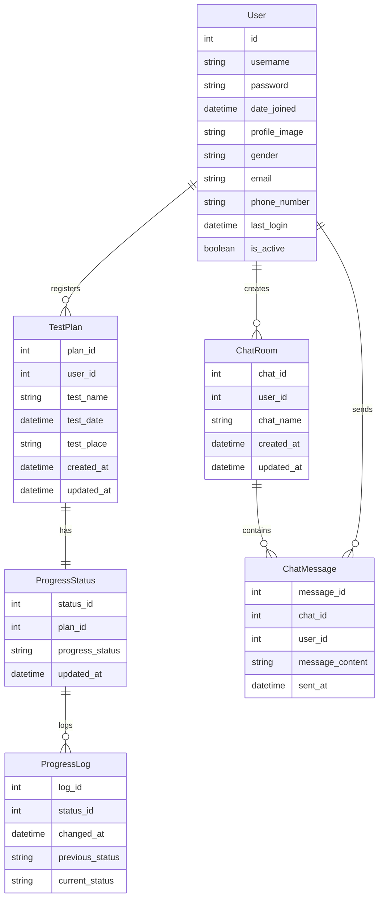

# Group 6 최종 발표

---
### 팀 소개
- 팀 이름: CBook.go
- 팀 구성원:    
    | 이름 | 역할 | 맡은 업무 |
    | --- | --- | --- |
    | 윤수용 | 리더 | 프로젝트 일정 관리, 핵심 기능 개발, 배포 환경 구축 |
    | 유민석 | 부리더 | 백엔드 구축, 핵심 기능 개발 |
    | 이지훈 | 서기 | 프론트엔드 구현, 부가 기능 개발 |

---
### 프로젝트 개요

- 프로젝트 이름: StudyM**AI**T
- 목적:
    - 자격증 수험생들을 위한 맞춤형 학습 관리 서비스로, AI 챗봇을 통한 개인화된 학습 계획 수립과 진도 관리, 동기 부여 기능을 제공
- 주요 타겟 사용자:
    - 수험생
- 주요 기능
    - AI 챗봇 기반 학습 계획 수립
    - 대시보드 기반 학습 현황 관리
    - 스마트 알림 시스템 : 학습 리마인더, 동기부여, 진도 체크
    - 복수 자격증 학습 관리
- 기대 효과:
    - 체계적인 학습과 지속적인 동기부여로 학습 중단율 감소
    - 자격증 학습 관리 시장에서 AI기술을 활용한 차별화된 포지셔닝
    - 사용자 데이터 기반의 지속적인 서비스 개선 가능

---
### 개발 기간 및 일정

- 총 개발 기간: 4주
- 주 단위 일정:
    - 1주차: SA 문서 작성, Django 프로젝트 환경 구축, 핵심 기능 프로토타입 제작
    - 2주차: 핵심 기능 프로젝트에 반영, 부가 기능 개발, 시간 남으면 프론트엔드 개발
    - 3주차: 프론트 - 백엔드 연동, 테스트 및 버그 수정
    - 4주차: AWS 배포 환경 구축, 문서화 완료

---
### 개발 환경

- 프론트엔드:
    - 주요 기술: shadcn/ui ([https://ui.shadcn.com](https://ui.shadcn.com/)) 활용
    - 개발 도구: VS Code
- 백엔드:
    - 주요 기술: Django DRF
    - 개발 도구: Postman, Docker, VS Code
- 데이터베이스:
    - 주요 기술: MySQL, Redis
    - 개발 도구: DBeaver, MySQL Workbench
- 협업 및 버전 관리:
    - Git/GitHub, Notion, Slack

---
### Process Flow

> [Process Flow](https://www.tldraw.com/r/7xdSslg_ZKOyViOdPXqUK?d=v-2484.-565.5874.3283.N0np7SXlcj89AMBML1vpu)

---
### MVP 기능 선정

- 우선 순위 기능
    - 회원 가입/로그인
    - 수험 정보 기반 학습 계획 생성 및 관리
    - 진도 체크 기능
    - 기본 알림 기능
    - 간단한 챗봇 기능
- 후순위 기능
    - 업적 시스템
    - 음성 알림
    - 학습 완료시 퀴즈 기능
    - 프론트엔드 고급 기능

---
### 와이어 프레임
> [와이어 프레임](https://www.tldraw.com/r/7xdSslg_ZKOyViOdPXqUK?d=v400.0.2048.1145.Hct-xuf-i-lvOJvWwQ6MY)

---
### 화면 시안
> [화면 시안](https://www.figma.com/board/BI45LxiH9gPlGaDtZht632/CBook?node-id=0-1&t=fOSvmfRIMEsJ6Mk6-1)

---
### ERD (Entity-Relationship Diagram)

- ERD Diagram

- 주요 테이블:
    - User(회원)
    - TestPlan(시험 계획)
    - ProgressStatus(진행 상태)
    - ChatRoom(채팅 방)
    - ChatMessage(채팅 메시지)
    - ProgressLog(상태 변경 기록)

- 테이블 간 관계:
    - User ↔ TestPlan: [1:N]
    - TestPlan ↔ ProgressStatus: [1:1]
    - ProgressStatus ↔ ProgressLog: [1:N] (선택 사항)
    - User ↔ ChatRoom: [1:N]
    - ChatRoom ↔ ChatMessage: [1:N]
    - User ↔ ChatMessage: [1:N]

---
### API 명세서

---
### 기능 명세서
